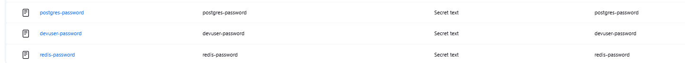

# DevOps Challenge

## Project Scope
- Provisioned via Terraform(K3s)
- All setup and management steps are versioned in a single Git repository.
- All passwords and sensitive information are stored as Kubernetes Secrets.
- PostgreSQL and Redis are installed and configured via Helm Charts.
- Jenkins is used for building and deploying applications.
- Data persistence and daily backups are configured for PostgreSQL.
- Redis is available for caching.
- Everything is installable and testable via provided CLI scripts.

---

## Installation

### 1. Requirements

- Ubuntu 22.04+ (clean virtual machine)
- `curl`, `redis-cli`, `psql`, `git`, `kubectl`, `helm`, `terraform`
- DockerHub account (for the example app)

### 2. Quick Start

1. Clone the repository:
```sh
git clone https://github.com/yunusemretosun/devops-challenge.git
cd devops-case
```
2. Setup environment and dependencies:
```sh
bash scripts/setup_environment.sh
```
3. Deploy Jenkins, PostgreSQL and Redis
```sh
# Install Jenkins
helm upgrade --install jenkins jenkins/jenkins \
  --namespace jenkins \
  --create-namespace \
  -f helm-charts/jenkins/values.yaml \
  --wait --timeout 3m

#required roles for deployment all namespaces
kubectl apply -f helm-charts/jenkins/roles.yaml

#Get Jenkins UI credentials
kubectl exec --namespace jenkins -it svc/jenkins -c jenkins -- /bin/cat /run/secrets/additional/chart-admin-password && echo

#Access Jenkins UI
echo "http://$(hostname -I | awk '{print $1}'):30080"

#Install PostgreSQL and Redis with Jenkinsfile.infra



#Install PostgreSQL and Redis Manuel
# Create namespaces
kubectl create ns postgresql
kubectl create ns redis
# Create secrets (replace <changeme> with secure passwords)
kubectl create secret generic my-postgres-secret \
  --from-literal=postgres-password=<changeme> \
  --from-literal=password=<changeme> \
  -n postgresql

kubectl create secret generic redis-secret \
  --from-literal=redis-password=<changeme> \
  -n redis

# Install Jenkins
helm upgrade --install jenkins jenkins/jenkins \
  --namespace jenkins \
  --create-namespace \
  -f helm-charts/jenkins/values.yaml \
  --wait --timeout 3m

#required roles for deployment all namespaces
kubectl apply -f helm-charts/jenkins/roles.yaml

#Get Jenkins UI credentials
kubectl exec --namespace jenkins -it svc/jenkins -c jenkins -- /bin/cat /run/secrets/additional/chart-admin-password && echo

#Access Jenkins UI
echo "http://$(hostname -I | awk '{print $1}'):30080"
	
# Install PostgreSQL
helm upgrade --install postgresql bitnami/postgresql \
  -n postgresql -f helm-charts/postgresql/values.yaml
	
# Install Redis
helm upgrade --install redis bitnami/redis \
  -n redis -f helm-charts/redis/values.yaml
```
### 3. Testing
```sh
#Postgresql test
bash scripts/postgre_test.sh

#Redis Test
bash scripts/redis_test.sh

 
